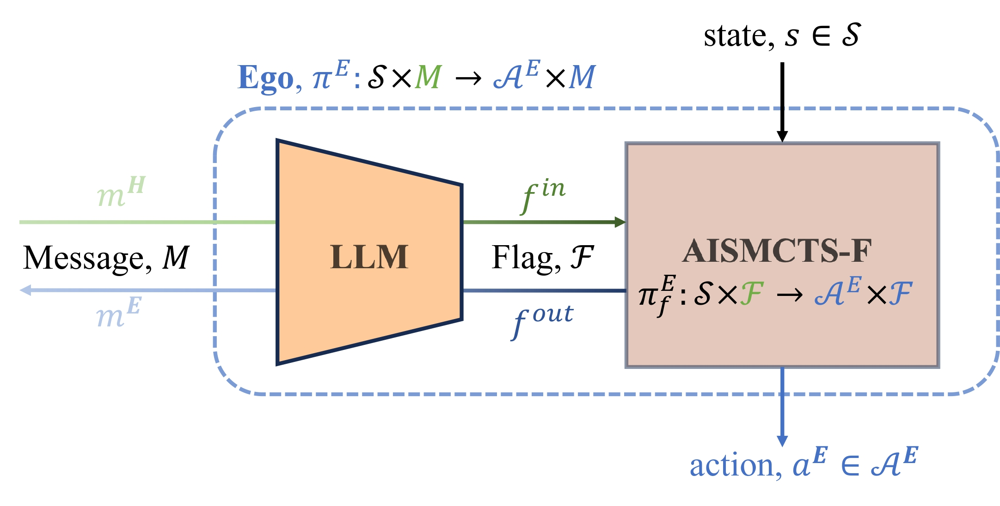

# Human-Agent Cooperation in Games under Incomplete Information through Natural Language Communication
- Shenghui Chen, Daniel Fried, Ufuk Topcu
- International Joint Conference on Artificial Intelligence (IJCAI), Human-Centred Artificial Intelligence track, 2024

<div align="center" style="font-size: 24px; font-weight: bold;">
<!--   <a href="link-to-code">Code</a> |-->
  <a href="link-to-ijcai-paper">Paper</a> |
  <a href="link-to-paper-main-appendix">Paper (main+appendix) on Arxiv</a> |
  <a href="https://shenghui-chen.com/publication/2024/03/22/shared_control_game/">Blog</a>
</div>

<div style="display: flex; justify-content: center; align-items: center; margin: 0 10px; margin-bottom: 20px;">
  
  
  
</div>

If you use this work, please cite:

```bibtex
@inproceedings{chen2024sharedcontrol,
  author={Chen, Shenghui and Fried, Daniel and Topcu, Ufuk},
  booktitle={International Joint Conference on Artificial Intelligence (IJCAI), Human-Centred Artificial Intelligence track}, 
  title={Human-Agent Cooperation in Games under Incomplete Information through Natural Language Communication}, 
  year={2024},
}
```

## Abstract
Developing autonomous agents that can strategize and cooperate with humans under information asymmetry is challenging without effective communication in natural language. 
In this paper, we use a testbed based on *Gnomes at Night*, a search-and-find maze board game. 

We introduce a *shared-control game*, where two players collectively control a *token* in alternating turns to achieve a common objective under incomplete information. 
We formulate a policy synthesis problem for an autonomous agent in this game with a human as the other player.

To solve this problem, we propose a *communication-based approach* comprising a language module and a planning module. The language module translates natural language messages into and from a finite set of *flags*, a compact representation defined to capture player intents. The planning module leverages these flags to compute a policy using an *asymmetric information-set Monte Carlo tree search with flag exchange* (AISMCTS-F) algorithm we present. 
